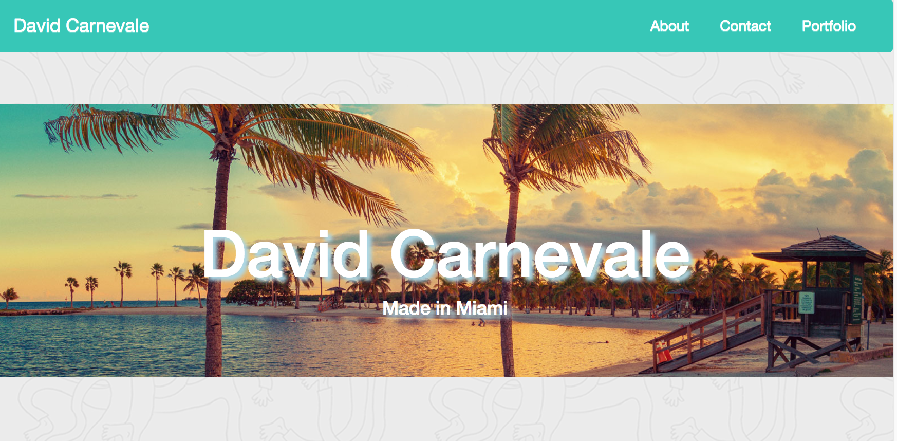
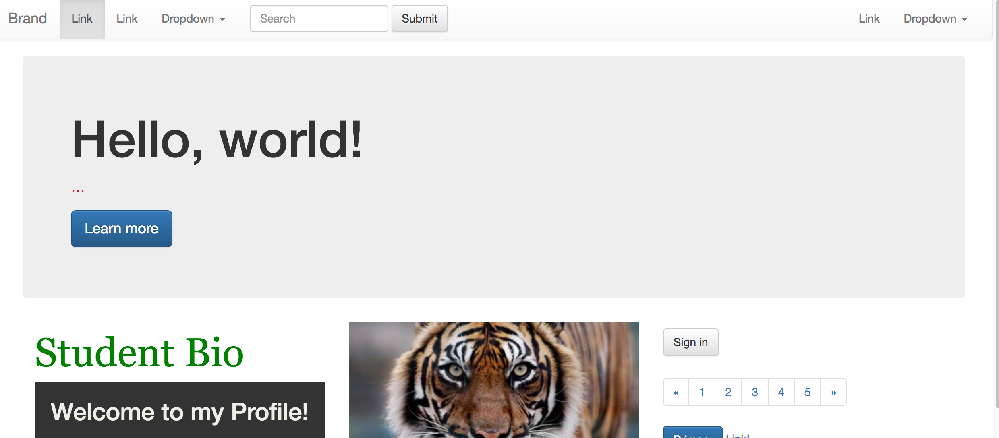

## Week 2 Assignment - Bootstrap Portfolio

### Overview

You'll use the following screenshots to subjectively grade student assignments.

Grading & feedback should not take more than 5 minutes per assignment.

**What does an A or B look like?**

* The student used covered concepts to complete the assignment. They customized the template quite a bit, and made it their own.

* An A is very polished, a B is almost there.

* If the student received an A, add a comment of encouragement. ("Great job!",  "You're on the right track, keep working hard!", etc.)

* If the student received a B, give 2 or 3 pieces of specific feedback for improvement.

**What does a C look like?**

* The student made a solid attempt, but has a long way to go.

* Give 2 or 3 pieces of specific feedback for improvement, and invite the student to office hours to cover topics not mastered.

**What does a D or F look like?**

* If a student doesn't deploy their project successfully, they receive a D. Tell them why, and ask them to come to office hours to learn how to deploy.

* If a student doesn't turn anything in, they receive an F. Tell the student "When you don't understand is when I need to see your code most, please turn in a blank github next time. Come to office hours, and I can help! Let's get back on track together."

- - -

**Good Luck!**

## Copyright

Coding Boot Camp © 2016. All Rights Reserved.
